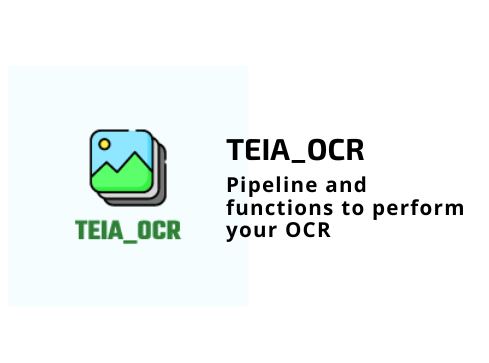

<h1 align="center">
    
</h1>

<h4 align="center"> 
	🚧 TEIA OCR 1.0 🚀 em desenvolvimento... 🚧
</h4>

<p align="center">
  

  

  	
  <a href="https://www.linkedin.com/in/emerson-rafael/">
    
  </a>
	
  
  <a href="https://github.com/emersonrafaels/teia_ocr/commits/main">
    
  </a>

  
   <a href="https://github.com/emersonrafaels/teia_ocr/stargazers">
    
  </a>
</p>


## 💻 About the project

📦 

## 🛠  Technologies


- [Python]

## 🚀 How to execute the project

1. **Install**: pip install -r requirements.txt

Ex: Execution Example:

```python
from pathlib import Path
from random import choice

from MODEL.image2text import execute_ocr

# SETTING THE DIRECTORY WITH IMAGES TO TEST
dir_images = "TESTS/IMAGES/training_data/images"

# SETTING EXTENSIONS ACCEPTED
types_accepted = (".png", ".jpg")

# GETTING ALL IMAGES
list_all_images = [str(file) for file in Path(dir_images).absolute().iterdir() if file.suffix in types_accepted]

# RANDOM AN IMAGE AMONG ALL
image = choice(list_all_images)

print("SELECTED IMAGE: {}".format(image))

# REQUEST OCR
result_ocr = execute_ocr(image_input=image, view_image=True)

print(result_ocr)

```

## ➊ Requirements


## [≝] Tests


## 📝 License

This project is under MIT License.

Developed ❤️ by **Emerson Rafael** 👋🏽 [Contact me!](https://www.linkedin.com/in/emerson-rafael/)

[Python]: https://www.python.org/downloads/